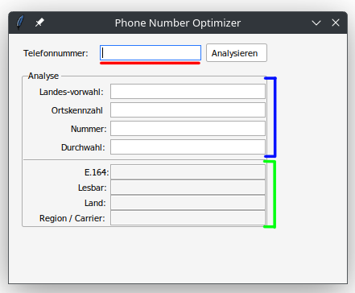
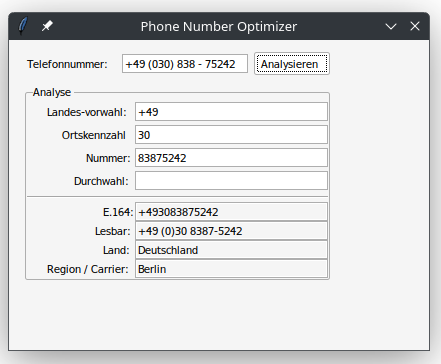

# Benutzerdokumentation

Zum Verwenden der Anwendung muss diese zuerst heruntergeladen werden.
Den Download-Link finden sie im jeweiligen Release.
Sobald sie die Anwendung auf ihrem Rechner haben, kann diese mit einem simplen Doppelklick auf die Datei ausgeführt werden.
Nach dem Starten der Anwendung erscheint folgendes Fenster:

Im Bild rot markiert ist das Eingabefeld. Hier können sie eine Telefonnummer eingeben oder editieren.
Sobald sie mit ihrer Eingabe zufrieden sind, können Sie auf den Button "Analysieren" klicken.
Anschließend werden Ihnen die erkannten Bestandteile der eigegebenen Telefonnummer im blau markierten Bereich angezeigt.
Im grün markierten Bereich sehen Sie zusätzliche Informationen zur Nummer, wie das Land, in dem die Nummer registriert ist.

Im folgenden Bild sehen sie das Fenster, nachdem eine beispielhafte Telefonnummer analysiert wurde:

Sollten Sie eine ungültige oder nicht lesbare Nummer eingeben, wird sie das Programm darauf hinweisen.
Zum Beenden der Anwendung können Sie auf das "X" in der oberen rechten Ecke des Fensters klicken.